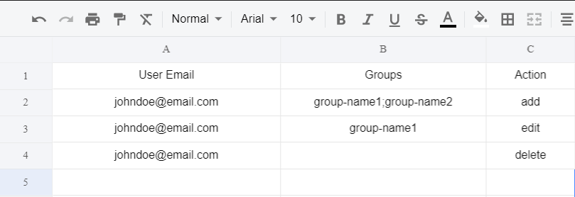
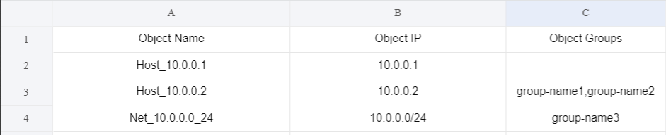

# Checkpoint Automation

This is a project for automating tasks in the Checkpoint Firewall Security version R80.XX.


# Installation

### Libraries
```pip install pandas```

```pip install --upgrade git+https://github.com/CheckPointSW/cp_mgmt_api_python_sdk```

### Running the script
Execute the ```main.py``` file in the corresponding project folder for the tak ythat you wnt to prun.

# Tasks

Currently the project has the following tasks automated:

- User creation and assigning to groups
- Object creations and assigning to groups


# Constraints

## User Mobility
-  A user / group name should not contain whitespaces.
- When providing the email of the user, the script takes everything before the ```@``` to create the name of the user. Hence, each user created will have distinct names.
- Available ```Actions``` are ```add```, ```edit``` and ```delete``` ONLY. Any other arguments provided in the action section will stop the script.
- If one row fails to process, the whole session is discarded and the error message will be provided to the user for he/she to fix it.
 - When adding a user, leaving the ```Groups``` section empty will result in the creation of the user ONLY.
- If you want to add the user to a group, you will need to specify the group name in the group section.
- If you want to add the user to multiple groups, you will need to separate the group name with a ```;```.
- The ```Action``` ```delete``` will remove the user completely whereas the action ```edit``` will remove users in specified groups.
- If a group is not already present on the firewall, the script witll create it.

## Object Creation
- An object / gr upname should no contain whitespaces.
- If one row fails to process, the whole session is discarded and the error message will be provided to the user for he/she to fix it.
- When adding an object, leaving the ```Groups``` section empty will result in the creation of the object ONLY.
-  If you want to add an object to a group, you will need to specify the group name in the group section.
-  If you want to add the user to multiple groups, you will need to separate the group name with a ```;```.
-  If a group is not already present on the firewall, the script witll create it.

# File Formats

## User Mobility

We should always add user data in an excel with the following format:



## Object Creation

We should always add objects in an excel with the following format:




# Settings

## User Mobility

All information about the SMS, API version and path of the user data excel sheet is configured in a ```config/settings.json file``` as such:

```
{
    "sms": {
        "host": "X.X.X.X"
        "username": "USERNAME",
        "password": "PASSWORD",
        "gateways": ["GATEWAY-NAME"],
        "policy": "POLICY-NAME"
        "gateways": ["CKP-GW-MU"],
        "policy": "Standard"
    },
    "api": {
        "version": 1.1
    },
    "user_data": {
        "path": "Checkpoint_User_Mobility/config/User-Mobility-Test.xlsx"
    }
}
```

Any changes to the sms credentials or path of the excel file should be changed in the settings file.


All information about the SMS, API version and path of the user data excel sheet is configured in a ```config/settings.json file``` as such:

```
{
    "sms": {
        "host": "X.X.X.X",
        "username": "USERNAME",
        "password": "PAS
    },
    "api": {
        "version": 1.1
    },
    "object_data": {
        "path": "Checkpoint_Object_Creation/config/Object_Creation-Data.xlsx"
    }
}
```

Any changes to the sms credentials or path of the excel file should be changed in the settings file.


# License
Copyright 2020 Mervin Hemaraju